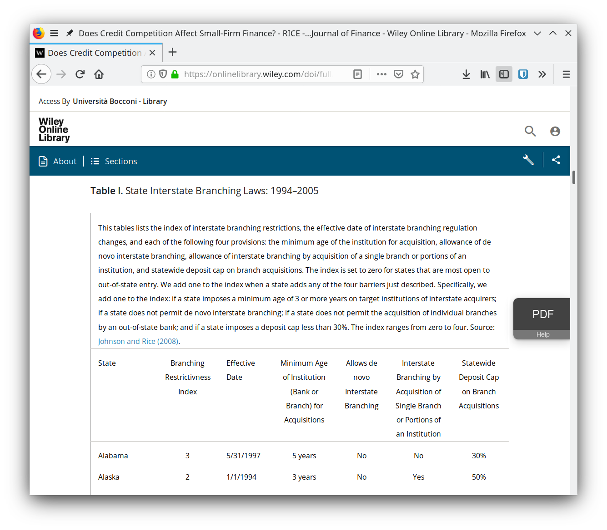

# IBBEA Branching Index

[Johnson and Rice (2008)](https://scholarlycommons.law.wlu.edu/wlulr/vol65/iss1/4/) define a branching index to measure how much a US State restricts competition across banks.

The index is known to economists mostly thanks to [Rice and Strahan (2010)](https://onlinelibrary.wiley.com/doi/full/10.1111/j.1540-6261.2010.01555.x), who use it to study the effect of credit competition on small-firm performance.

The purpose of this repository is to collect the index from Rice and Strahan (2010) and provide it as a machine-and-human-readable HTML document together with a small Python program that translates it into a machine-readable CSV dataset.

## Methodology

Very simple.
I copy-pasted the HTML table that is found on the HTML version of the paper by [Rice and Strahan (2010)](https://onlinelibrary.wiley.com/doi/full/10.1111/j.1540-6261.2010.01555.x) into the file [`johnson_rice_branching_index.html`](./johnson_rice_branching_index.html).
The copy-paste is not exact: the caption of the table was originally contained into a table row, which I unpacked into raw text outside the table.
This means that the `<table>` tag only contains data to be exported to CSV and nothing else.

The program [`html2csv.py`](./html2csv.py) is a small Python program that uses [BeautifulSoup](https://www.crummy.com/software/BeautifulSoup/) to parse the table and [pandas](https://pandas.pydata.org/) to export it to CSV.
The advantage of using BeautifulSoup is that one can simply redirect the Python program to read the original table that is found on [Wiley's website](https://onlinelibrary.wiley.com/doi/full/10.1111/j.1540-6261.2010.01555.x) (which probably lies behind a paywall).

## Usage

    $ python3 html2csv.py <out_filename>
    
where `<out_filename>` is the name (and location) of the CSV file that will be saved as output.
